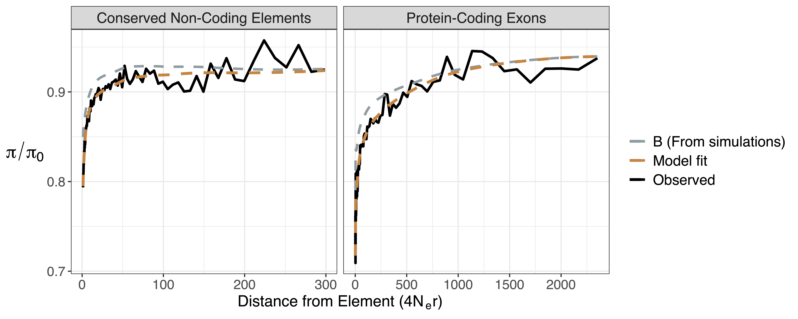

# Fitting a model of selective sweeps and background selection to troughs in nucleotide diversity

This directory contains the code, input files, results and plots showing the fit of a model of recurrent selective sweeps and background selection to patterns of diversity in the mouse genome.

The files beginning with ```inputFiles/Mmc.*``` are the results from the mouse genome. Those beginning with ```inputFiles/Exons*``` or ```inputFiles/CNEs*``` are results from simulated data.

The script ```bin/MouseTroughFit.py``` and ```bin/MouseTroughFitTable.py``` fit the data using non-linear least squares. Note that I wrote these scripts using Python 2.7. Often modern machines use Python3 by default, so make sure that you specify version 2.7. 



